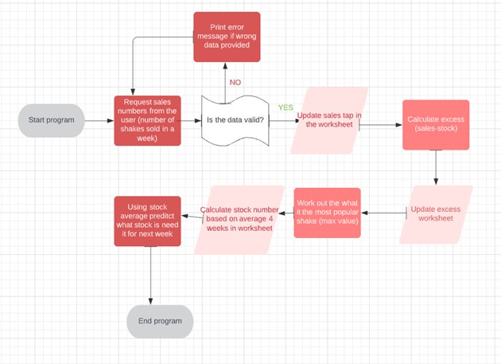

Table of Contents
# UX
# User Stories
# Features
# Data model
# Testing
# Bugs
# Remaining bugs
# Validator Testing 
# Deployment

PythonEssential  -  command-line application to analyse survey data for a CrossFit Café to help them with the healthy shake sales and predicting  the future sales, by YoannaLa

## The deployed site can be find:
https://crossfit-cafe.herokuapp.com/

# UX
## Website owner business goals
This application was created to track sales of their healthy shakes for CrossFit gym in South West London.  They only open few months ago and they trying to work out which one are the most popular. The gym is open 7 days a week and they are preparing the shakes ingredients and keep it in the fridge for up to 7 days. The new batch is prepared on Mondays so the sale data is submitted on Sunday. 
### User goals
The application help the CrossFit gym staff to prepare and stock the right amount of prepared shakes mixes. It saves them time to prepare the shakes to the customer which makes it all around better experience.

## Data model
I wanted to create a useful application which makes life easier. I have created a flow chart to add steps to help me to see the application thru.
## Features
1. Analyse Survey Data application has the following features
2. Display greetings for the user to CrossFit Café data collection and advise on what data to input	
3. Add the sales of 5 shakes types and give example what kind of data input is requested

4. if the date is put in correctly, (5 numbers separated by comma), the application updates and calculates the sales, surplus and stock on the external worksheet (google spreadsheet)

5. Tells the user what was the most popluar buy

6. last step is to advise on the amount of smoothies to be prepared for next week

## Data model
I’ve decided to use and build on the walkthrough project idea and build on my CrossFit theme.
The application calculated stock and advise on what to prepare for next week sales.

I've also used the flow chart to understand what I need to to and what do I wnat to achive in this project:

# Testing
I have test the project by doing the following:
    * passing code through a PEP8 and made the changes as per below
    * Keep testing it in gippod in terminal by putting different data and checking the outcomes
    * Testing in Code Institute Heroku terminal 

    
# Validation Testing 
## I used PEP8
I have tested the code on PEP8 and it come out with those errors:

I have fixed the error as per instruction and run the code again.

The few error's I couldn't fixed is the lines to long in my code. I couln'd work out how to combaine the rows and max values.

## Bugs
I had removed all the whiespaces and added/removed spaces as per "problems taps in gitpod"

# Deployment
### This project was deployed on Heroku
I have set up and account on Heroku:
1.	Create a new app – with the button provided
2.	Add a name to app – crossfit-cafe
3.	Selected Europe as a region and click “Create app”
4.	Select setting tab 
a.	 config vars and store my credentials file creds.json sensitive data file (info taken from my Gitpod working environment). – to access the spreadsheet
i.	Field key – added CREDS (in capital letters)
ii.	Field value – paste entire creds.json file
iii.	Click “add”
5.	“Add Buildpacks” – first I’ve added Python and clicked “save” and added node.js and clicked “save” 
6.	Select deploy tab
7.	Connect to Github
8.	Search for repository name in Github, clicked “search” and clicked “connect”
9.	Scrolled down and select “manually deploy”
10.	After the “App was  successfully deployed”  clicked view to open the site in heroku
11.	The deployed site can be found: https://crossfit-cafe.herokuapp.com/

# Credits
I have reached for help to my mentor and fellow students and couple of friends how are developers
Used those website: (https://www.w3schools.com/), (https://developer.mozilla.org/), (https://codepen.io/), (https://learn.codeinstitute.net/),

