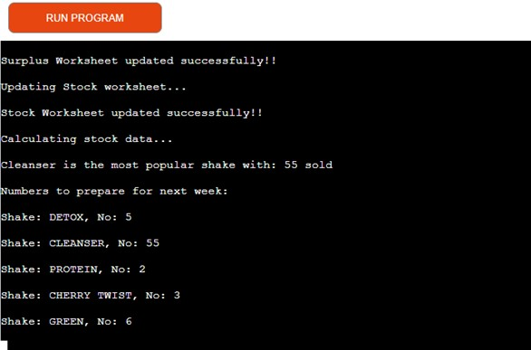

Table of Contents
# UX
# User Stories
# Features
# Data model
# Testing
# Bugs
# Remaining bugs
# Validator Testing 
# Deployment

PythonEssential - command-line application to analyse survey data for a CrossFit Café to help them with the healthy shake sales and predicting  the future sales, by YoannaLa

## The deployed site can be find:
https://crossfit-cafe.herokuapp.com/

# UX
## Website owner business goals
This application was created to track sales of healthy shakes for CrossFit gym in South-West London. They only open few months ago and they trying to work out their stock preparation. The gym is open 7 days a week and they are preparing the shakes ingredients and keep it in the fridge for up to 7 days. The new batch is prepared on Mondays, so the sale data is submitted on Sunday. 

### User goals
The application help the CrossFit gym staff to prepare and stock in right amount of prepared shakes mixes. It saves them time to prepare the shakes to the customer which makes it all around better experience.

## Features
Analyse Survey Data application has the following features:
* Display greetings for the user to CrossFit Café data collection and advise on what data to input 
* Adding the selling data from Sunday

* If the date is in a correct format, (5 numbers separated by comma), the application updates and calculates the sales, surplus and stock on the external worksheet (google spreadsheet)

* The application advise what calculation or update is doing to insure the user that the application is working, before displaying the final application 
**Calculates and advise the bests seller in last 4 weeks, which somethings happens to be more that one shake 

* Last step, the application is advising on the amount of smoothies to be prepared for next week

## Issues
I enjoy creating this application, however I got dropped by my mentor after having one meeting with her. So I have an new mentor assigned to few dates before the submission, which I must admit it was very unprofessional and yet again I felt unsupported days before the submission. Also, I only found out that if you use 60 minutes of the online support the waiting time is extended. I wish this was communicate earlier…  So far keep being disappointing in the luck of clarifying and support. I’ve been assigned a new mentor, who seems to be great and being given 2 day extension on my deadline, which I really appreciate. However, I wish I was getting the curve balls few days before my deadline – unnecessary stress. 

## Data model
I’ve decided to use and build on the walkthrough project idea and build on my CrossFit theme.
The application calculates stock and advises on what to prepare for next week sales. The surplus data helps to minimalize the waste. 

I imported few external libraries to this project to be able to use my googlesheet with data, I’ve created earlier; those are goggle-auth and gspread

I've also used the flow chart to understand what do I want to achieve in this project:

# Testing
I have test the project by doing the following:
    * passing code through a PEP8 and made the changes as per below
    * Keep testing it in gippod in terminal by putting different data and checking the outcomes in the terminal and worksheet
    * Testing in Code Institute Heroku terminal 

    
# Validation Testing 
## I used PEP8
I have tested the code on PEP8 and it come out with those errors:

I have fixed the error as per instruction and run the code again.

The few error's I couldn't fixed is the lines to long in my code.

## Bugs
I had removed all the whitespaces and added/removed spaces as per "problems tap” in gitpod". I had few issues with the project, to stared I didn’t pin my workspace correctly so when I was coming up with gitpod and I had to add the creds.json file till I figure it out how to pin the workspace (different to the video provided in the course). 

# Deployment
### This project was deployed on Heroku
I have set up and account on Heroku:
1.  Create a new app – with the button provided
2.  Add a name to app – crossfit-cafe
3.  Selected Europe as a region and click “Create app”
4.  Select setting tab 
a.   config vars and store my credentials file creds.json sensitive data file (info taken from my Gitpod working environment). – to access the spreadsheet
i.  Field key – added CREDS (in capital letters)
ii. Field value – paste entire creds.json file
iii.    Click “add”
5.  “Add Buildpacks” – first I’ve added Python and clicked “save” and added node.js and clicked “save” 
6.  Select deploy tab
7.  Connect to Github
8.  Search for repository name in Github, clicked “search” and clicked “connect”
9.  Scrolled down and select “manually deploy”
10. After the “App was  successfully deployed”  clicked view to open the site in heroku
11. The deployed site can be found: https://crossfit-cafe.herokuapp.com/
12. Since I've chosent the manual deployment I had back up my code in gitpod(git push) and redepoy my site in Heroku

# Credits
I have reached for help to my mentor and fellow students and couple of friends how are developers
Used those website: (https://www.w3schools.com/), (https://developer.mozilla.org/), (https://codepen.io/), (https://learn.codeinstitute.net/),

